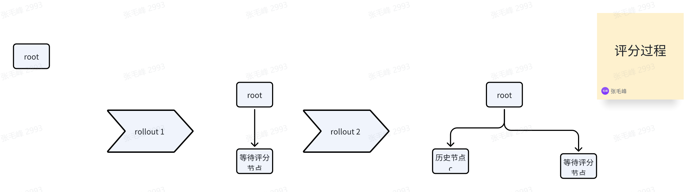
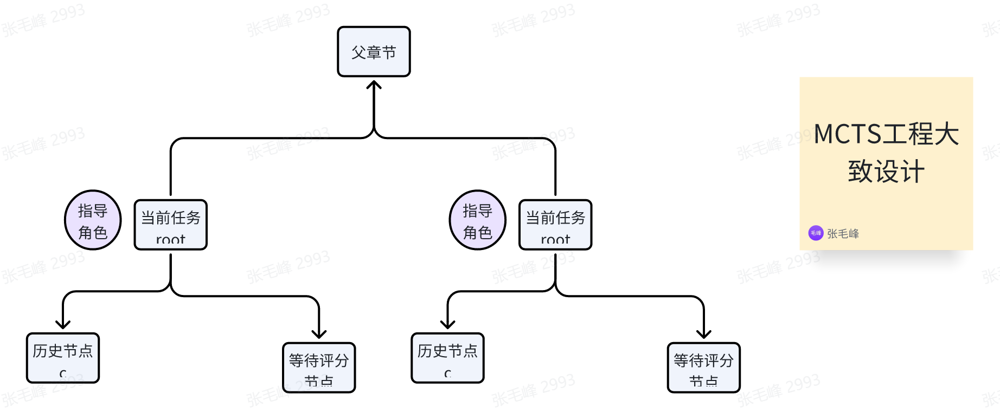

1. ##### MCTS的工程化实现

MCTS的方法在很多需要引入策略优化的场景中都有些应用，其推出的目的是期望在不同策略上，通过构建树结构评分，完成对子任务的最优路径的获取

其算法分成了两个过程，总结为这句话：逐步探索存在的**可能**，探索了最大限度后，从所有可能获取最优的结果



第一个过程主要用来进行数据更新，

此过程分成如下步骤，

按照rollouts次数进行均值评分、

从评分节点到root路径，更新路径上节点的Q值((node.Q + best_child_Q) / 2)

暂时无法在飞书文档外展示此内容

第二个过程,在当前节点顶而上的更新数据

获取的合适的node会在每次进行rollouts开始，对树进行路径压缩，通过UTC(Upper Confidence Bound)规则进行选取节点,至于为什么第一次没有（因为没有子节点

这个过程会找到最合适的节点，q越小越不容易被选中

进行第一个过程，直到到达最大的rollouts迭代次数

1. ##### **长文本思维链生成思路分享**

长文本生成大家一直都在解决一些问题，如文本幻觉、文本的语调色彩、文本的上下文关联

这里提出了一个思路，通过一些思维链的方式，通过规划任务先为编写文章的作者提供一个写作场景，

将执行任务过程抽象为搜索树结构，树节点共享场景的上下文信息（文章历史，章节信息，参考信息

同时每个搜索任务都会自动通过思维链构建出一个抽象角色，由角色引导当前的任务应该如何写作



具体来说，我们采用模型的先验知识，来让每个子任务通过在上下文中资源，通过自身反思探索来获取自身对问题的最优答案；这种方式依赖模型的对齐偏好，需要为每种偏好上设计了一个工程框架，来完成自我对不同答案的奖励进行采样策略

 我对标准的MCTS做了如下修改

```Plain
1、对问题生成的子任务，生成一个合理的规划的节点
2、对每个节点创建一个MCTS任务，
3、输入 problem（总问题的子任务相关的子问题）
4、评分代码重构，将片段摘录器模块集成到一个关于_evaluate_answer逻辑提示模板，模板主要作用：将每个子问题相关的loader_cosplay_builder构建一个关于evaluate_system_prompt 的生成策略，具体的为编写一个关于带有评估的评估器，由loader_cosplay_builder方法返回场景执行器（CodeGeneratorBuilder），使用add_generator添加一个问答策略(CodeGenerator)中构成问答交互，build_executor后执行  executor.chat_run() 返回_ai_message
5、自我反思代码重构,将片段摘录器模块集成到一个关于self_refine逻辑提示模板，模板主要作用：将每个子问题相关的loader_cosplay_builder构建一个关于critic_system_prompt和refine_system_prompt的生成策略，critic_system_prompt为生成一个关于子问题相关的loader_cosplay_builder中自身不完美的评价内容，refine_system_prompt为不完美评价的思考过程和评分值。
具体的为编写一个关于带有评价的生成器和反思生成器，它们由loader_cosplay_builder方法返回场景执行器（CodeGeneratorBuilder），使用add_generator添加一个问答策略(CodeGenerator)中构成问答交互，build_executor后执行  executor.chat_run() 返回_ai_message
```

MCTS中的约束规则如下，需要保证这些节点必须符合下面所定义的基本规则

提示约束：模型在奖励评分期间必须遵守最严格的标准。生成结果需要为JSON Response format

{

        "thought": "The thought process behind the answer.",

        "answer": "A float representing the answer to the problem."

}

高分抑制：评分节点中不存在满分反馈机制；任何超过 95 分的奖励都会按固定金额减少，以遏制过高分数。

重复采样：每次访问搜索树节点都涉及对节点奖励的重复采样，以增强自我评估的可靠性。需要注意的是，当对节点的子节点进行奖励采样时，我们也会对其父节点进行奖励采样，以增加奖励采样的样本量。